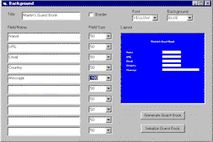



## \_a cool internet guest book wizard and generator

### Description

Guest Book Generator that will generate working HTML and ASP files when the generate guest book button is clicked. The HTML and ASP files are ready to deploy to a web server.
 
### More Info
 

             |
---                |---
**Submitted On**   |2000-12-04 06:02:20
**By**             |[martin castañeda](https://github.com/Planet-Source-Code/PSCIndex/blob/master/ByAuthor/martin-casta-eda.md)
**Level**          |Intermediate
**User Rating**    |4.8 (62 globes from 13 users)
**Compatibility**  |VB 5\.0, VB 6\.0
**Category**       |[Internet/ HTML](https://github.com/Planet-Source-Code/PSCIndex/blob/master/ByCategory/internet-html__1-34.md)
**World**          |[Visual Basic](https://github.com/Planet-Source-Code/PSCIndex/blob/master/ByWorld/visual-basic.md)
**Archive File**   |[CODE\_UPLOAD123111242000\.zip](https://github.com/Planet-Source-Code/martin-casta-eda-a-cool-internet-guest-book-wizard-and-generator__1-13261/archive/master.zip)

